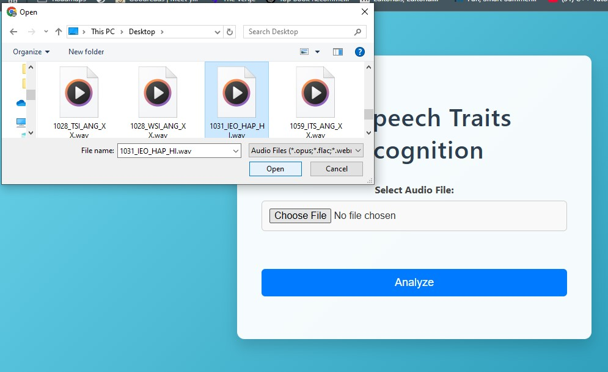

# 🎙️ Web-Based Gender & Emotion Recognition from Speech Audio

This project is an academic major project developed as part of my MCA degree. It aims to detect the **gender** and **emotional state** of a speaker based on their **speech audio input** using machine learning techniques.

---

## 🚀 Project Overview

- 🎯 **Goal**: Predict gender and emotion from recorded speech using trained machine learning models.
- 🧠 **Use Case**: Can be used in voice-based user profiling, emotion analytics, assistive systems, etc.
- 🌐 **Interface**: Web-based frontend to upload audio and receive predictions.

---

## 🛠️ Tech Stack

- **Frontend**: HTML, CSS, JavaScript
- **Backend**: Python (Flask)
- **ML Models**:
  - Gender Detection: LightGBM
  - Emotion Recognition: Convolutional Neural Network (CNN)
- **Libraries**: NumPy, Pandas, Librosa, scikit-learn, LightGBM, Keras, Flask
- **Dataset**: [CREMA-D](https://github.com/CheyneyComputerScience/CREMA-D)

---

## 📁 Features

- Upload audio file (.wav)
- Backend extracts features (e.g., MFCCs, Spectral Contrast, Pitch, Speactral roll-off)
- Predicts:
  - 👤 Gender (Male/Female)
  - 😃 Emotion (Happy, Angry, Sad, Neutral, etc.)
- Displays results on web interface

---

## Note on Age Prediction

> Age prediction was initially planned using an SVM model, but due to implementation challenges, it was not included in the final version. Future updates may include age estimation once the model is optimized and evaluated properly.

---

## 📸 Screenshots

### 🔹 Basic Interface  
  
*A simple form where users can upload .wav audio files for prediction.*

### 🔹 Audio Upload

*User selects a .wav file by clicking on the choose file button*

### 🔹 Prediction Result Page  
  
*After processing, the predicted gender and emotion are displayed here.*


## ⚙️ How to Run the Project

1. Clone the repo:
   ```bash
   git clone https://github.com/abhinab86/speech-traits-detector.git
   cd speech-traits-detector
